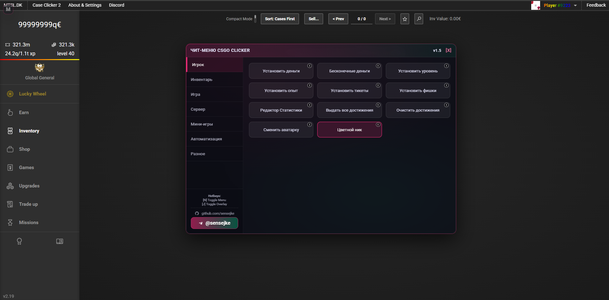
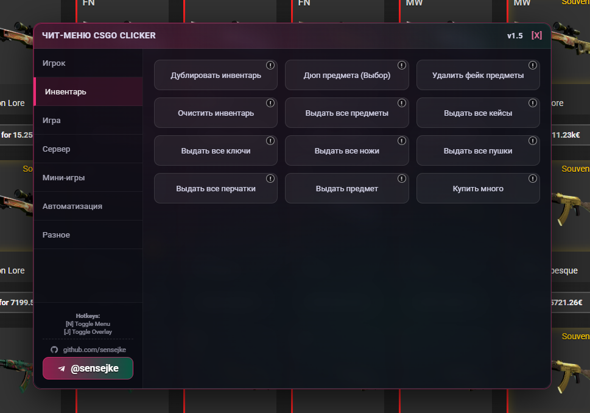

# CSGO Clicker Mod Menu 🟢

A powerful, modern, and feature-rich Mod Menu for [CSGO Clicker](https://csgo.mtsl.dk/).  

## 🖼 Screenshots

  
  

## 🚀 Features

### **Player & Stats**
- **Money / XP / Level / Tickets / Chips**: Edit core progression values instantly.
- **Static Money (Toggle)**: Freeze your balance at a high value.
- **Achievements**: Unlock or reset achievements.
- **Stat Editor**: Modify clicks, opened cases, playtime, and more.
- **Profile cosmetics**: Offline PFP changer + colorful name (client-side).

### **Inventory Management**
- **Give All Items (Optimized)**: Adds one of every item.
- **Dupe Inventory**: Clone your entire inventory.
- **Dupe Specific Item**: Select any inventory item to duplicate.
- **Clear Fake Items**: Remove bugged/unknown items.
- **Clear Inventory**: Remove all items from inventory.
- **Give All**: Cases / Keys / Knives / Guns / Gloves.
- **Give Specific Item**: Add an item by its exact name.
- **Custom Buy Multiple**: Buy items in bulk.

### **Game Tools**
- **Missions**: Finish / get new / discard / reset mission timer.
- **Free Shop (Toggle)**: Make everything cost $0.
- **OP Auto Clicker (Toggle)**: High-speed auto clicking.
- **Bypass Click Limit (Install)**: Removes the anti-autoclicker limit.
- **Multi Tab Fix**: Disables the “Multiple tabs detected” warning.

### **Server / Online**
- **Clear Online Coinflip**: Clears the local list of online coinflip games.
- **Anonymous ID (Toggle)**: Switches to a temporary random ID.
- **Coinflip Win (Visual/Local)**: Forces a visual win (does not affect server).
- **Jackpot Editor (Stub)**: Opens debug info.

### **Minigames & RNG**
- **Win Simulator**: Add chips for Crash, Roulette, Mines, Slots.
- **Rig RNG**: Force luck high (0.99) or low (0.001), reset anytime.

### **Automation 🤖**
- **Case Bot**: Auto-opens cases until the desired result drops.

### **Utilities**
- **Get Save / Load Save**: Export or import your save string.
- **True Wipe**: Full reset (local data).
- **Set Chrome Title**: Change browser tab title.
- **Hide Predator**: Hides Predator menu (if present).
- **Script Executor**: Run custom JavaScript code.
- **Version Checker**: Check mod menu version.
- **Fake Code Creator**: Generates a fake promo code.

---

## 📥 Installation

1.  **Install Tampermonkey**:
    - [Chrome / Edge](https://chrome.google.com/webstore/detail/tampermonkey/dhdgffkkebhmkfjojejmpbldmpobfkfo)
    - [Firefox](https://addons.mozilla.org/en-US/firefox/addon/tampermonkey/)
    - [Opera](https://addons.opera.com/en/extensions/details/tampermonkey-beta/)

2.  **Install Script**:
    - Create a new script in Tampermonkey and copy-paste the code from `mode.js`.
    - Optional: publish/install via Greasy Fork (if you uploaded it).

3.  **Activate**:
    - Open [CSGO Clicker](https://csgo.mtsl.dk/).
    - Press **`N`** to toggle the menu.
    - Press **`J`** to toggle the overlay.

---

## 🎮 Controls

| Key | Action |
| :--- | :--- |
| **N** | Toggle Mod Menu (draggable) |
| **J** | Toggle Stats Overlay (draggable) |
| **Esc** | Cancel active selection (e.g. Dupe Specific Item) |

---

## 🛠 Troubleshooting

- **Menu not opening?**
  - Make sure Tampermonkey is enabled.
  - Refresh the page (F5).
  - Check if the script is enabled for `csgo.mtsl.dk`.

- **Overlay not updating?**
  - Toggle it off/on with **`J`**.
  - Make sure the game is fully loaded.

- **"Item not found" error?**
  - The item name must match exactly what is in the game database.
  - Use **Clear Fake Items** to fix inventory issues.

---

## 📜 Credits

- **Author**: sensejke
- **Telegram**: https://t.me/sensejke
- **GitHub**: https://github.com/sensejke

---

**Disclaimer**: This script is for educational purposes only. Use at your own risk.
